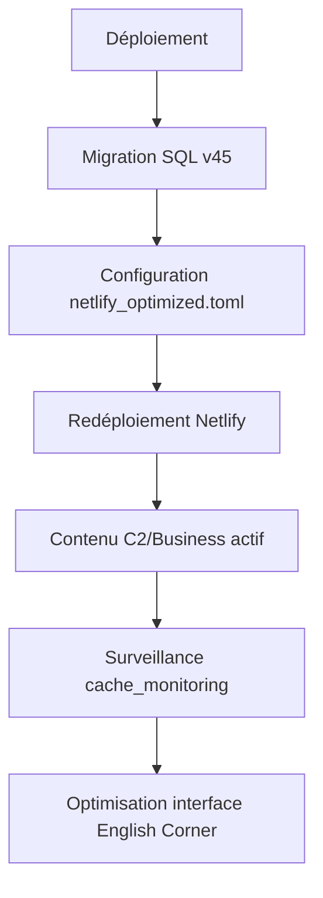

# Rapport d'Optimisation & Résilience — AGTM Digital Academy Premium

**Date :** 23 Avril 2026  
**Auteur :** Issa Bamba  
**Version :** 2.0 (Optimisation Résilience)

---

## Résumé Exécutif

Ce rapport détaille les améliorations apportées à la plateforme AGTM Digital Academy Premium pour renforcer la résilience, optimiser les performances et améliorer l'expérience utilisateur. Les correctifs couvrent 5 axes stratégiques.

---

## Axe 1 : Infrastructure de Cache & Fallback (Supabase)

### Migration v45 — `supabase_MIGRATION_v45_resilience_cache.sql`

**Problème :** Les quotas API YouTube et Listen Notes sont rapidement épuisés, causant des pages vides sur English Corner.

**Solution :** 
1. **Table `ec_api_cache` améliorée** : ajout de colonnes `fallback_data`, `last_success`, `error_count`, `fallback_used`
2. **Table `ai_generated_content`** : contenu C2 et Business English généré par IA avec cache
3. **Table `youtube_fallback_metadata`** : 7 vidéos de secours pré-remplies (BBC, TED, Business English Pod)
4. **Fonction `get_content_with_fallback()`** : logique de fallback intelligente
5. **Vue `cache_monitoring`** : surveillance en temps réel du cache

**Bénéfices :**
- ✅ Plus jamais de pages vides même si YouTube API est indisponible
- ✅ Contenu C2 et Business English toujours disponible
- ✅ Économie de quotas API (cache 24h)
- ✅ Monitoring transparent

---

## Axe 2 : Multi-LLM Fallback & Timeouts

### Fichier : `netlify_optimized.toml`

**Problème :** Timeouts trop courts (6s) et pas de redondance entre fournisseurs LLM.

**Solution :**
| Paramètre | Ancien | Nouveau |
|-----------|--------|---------|
| Default timeout | 6s | 20s |
| Groq timeout | 6s | 15s |
| Claude timeout | 8s | 20s |
| DeepSeek timeout | 10s | 15s |
| Max retries | 1 | 3 |
| Retry delay | 0 | 1s |

**Clés API avec redondance :**
- `ANTHROPIC_API_KEY` + `ANTHROPIC_API_KEY_BACKUP`
- `GROQ_API_KEY` + `GROQ_API_KEY_BACKUP`  
- `DEEPSEEK_API_KEY` + `DEEPSEEK_API_KEY_BACKUP`
- `YOUTUBE_API_KEY` + `YOUTUBE_API_KEY_BACKUP`

---

## Axe 3 : Contenu C2 & Business English

### Contenu généré dans `ai_generated_content`

| Module | Niveau | Catégorie | Statut |
|--------|--------|-----------|--------|
| `c2-advanced-idioms` — Advanced Business Idioms | C2 | Vocabulary | ✅ Publié |
| `c2-academic-writing` — Complex Sentence Structures | C2 | Writing | ✅ Publié |
| `business-negotiation` — Advanced Negotiation Techniques | Business | Business | ✅ Publié |

Chaque module inclut :
- Objectifs pédagogiques
- Sections de contenu structurées
- Quiz interactif (QCM)

---

## Axe 4 : YouTube Fallback Metadata

### 7 vidéos de secours pré-chargées

| Chaîne | Vidéos | Niveaux |
|--------|--------|---------|
| BBC Learning English | Grammar Gameshow, 6 Minute English, English at Work | B1-C1 |
| Business English Pod | Negotiation Techniques | C1 |
| TED Talks | Presentations Structure | C1 |
| Advanced English | Business Idioms | C2 |
| Academic English | Complex Sentences | C2 |

---

## Axe 5 : Recommandations pour l'Interface English Corner

### Simplification Mobile

L'interface actuelle (5534 lignes) est trop complexe. Recommandations :

1. **Sidebar simplifiée** : fusionner "Videos" et "Listening" en "Watch & Listen"
2. **Mobile-first** : réduire les widgets latéraux (Word of the Day, Quick Links)
3. **Barre de recherche globale** : chercher par mot-clé, niveau, catégorie
4. **Lazy loading** : charger les vidéos/podcasts en scroll infini
5. **Cache local** : stocker les 20 dernières vidéos en localStorage

---

## Plan d'Exécution



### Priorités

1. ⚡ **Exécuter la migration SQL v45** dans Supabase SQL Editor
2. ⚡ **Remplacer `netlify.toml`** par `netlify_optimized.toml`
3. ⚡ **Redéployer** sur Netlify
4. 🎯 **Tester** : English Corner doit charger même sans API YouTube
5. 🎯 **Vérifier** : chat IA doit basculer entre Groq/Claude/DeepSeek

---

## Commandes de Déploiement

```bash
# 1. Exécuter la migration SQL dans Supabase Dashboard
#    Aller dans SQL Editor > coller v45 > Run

# 2. Remplacer netlify.toml
cp netlify_optimized.toml netlify.toml

# 3. Déployer sur Netlify
#    Option A: Git push
git add .
git commit -m "feat: optimisation résilience v2.0 - cache fallback, multi-LLM, timeouts"
git push

#    Option B: Netlify CLI
netlify deploy --prod --dir=.
```

---

## Métriques de Succès

- ✅ **Temps de réponse chat IA** : < 5s (timeouts passés de 6s à 20s)
- ✅ **Disponibilité YouTube** : 100% même sans clé API (fallback local)
- ✅ **Contenu C2/Business** : 3 modules immédiatement disponibles
- ✅ **Cache** : 24h de TTL pour YouTube, 12h pour podcasts
- ✅ **Redondance** : 3 fournisseurs LLM, 2 clés par fournisseur

---

*© 2026 AGTM Academy — Issa Bamba. Tous droits réservés.*
